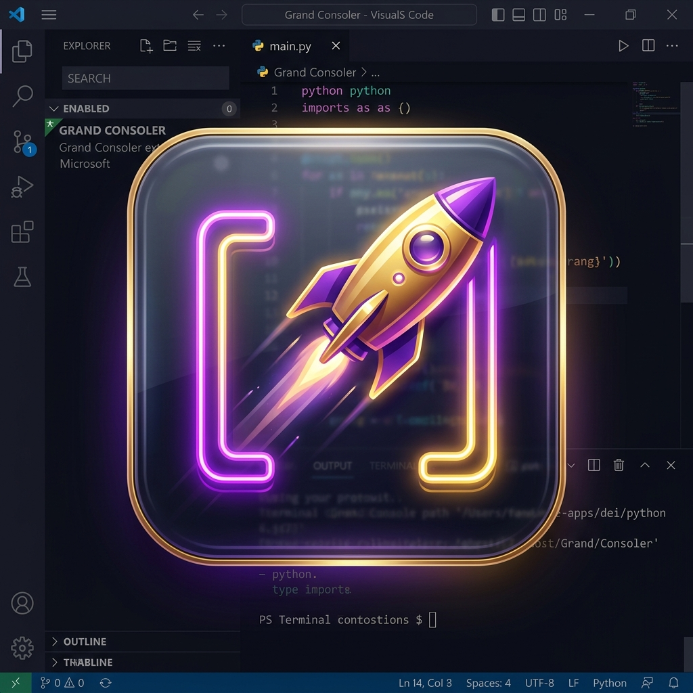

  

# 🚀 Grand Consoler

**Elevate your debugging workflow to the next level.**

Grand Consoler is a premium VS Code extension designed for developers who demand speed, structure, and a clean workspace. It simplifies log management across **JavaScript, TypeScript, and Flutter/Dart** with powerful automation and a sleek sidebar interface.

---

## ✨ Features

### 💎 Smart Log Insertion
Never type a manual log again. Use `Ctrl+Alt+L` (or `Cmd+Alt+L` on Mac) to insert a beautifully formatted, 3-line console output that includes:
- 🚀 **Rocket Emoji Branding**
- 📍 **Exact File & Line Number**
- 🏷️ **Context-Aware Function Name** (Classes, methods, and arrow functions)
- 📦 **Dynamic Variable Injection**

### 📋 Interactive Sidebar
A central hub for every log in your project.
- **Auto-Discovery**: Instantly scans your workspace for `console.log`, `debugPrint`, and `print`.
- **Inline Actions**: Hover over any log to **Delete** it or **Toggle Comments** without leaving the list.
- **One-Click Cleanup**: Global buttons to Comment All, Uncomment All, or Wipe All logs before you commit.

### 🛡️ Safe Management
- **Undo Support**: Accidentally deleted a log from the sidebar? Hit **Undo** on the notification to bring it back instantly.
- **Cross-Language Harmony**: Seamlessly switches logic between JS/TS and Dart/Flutter based on your active file.

---

## ⌨️ Keyboard Shortcuts

| Action | Keybinding (Mac/Win) |
| :--- | :--- |
| **Insert Formatted Log** | `Ctrl` + `Alt` + `L` |
| **Refresh Sidebar** | (Icon in Sidebar Title) |
| **Global Cleanup** | (Actions in Sidebar Title) |

---

## 🛠️ Supported Languages

- **Web**: `.js`, `.ts`, `.jsx`, `.tsx`
- **Mobile**: `.dart` (Full Flutter support)

---

## 🚀 Getting Started

1. **Install** the extension.
2. Open any `.ts` or `.dart` file.
3. Highlight a variable and press **`Ctrl+Alt+L`**.
4. Open the **Grand Consoler Activity Bar** (Terminal Icon) to see your logs grouped and ready for action.

---

## 💾 Manual Installation (VSIX)

If you want to use the extension without running a debugger or to share it with friends, you can install the pre-packaged `.vsix` file:

1.  **Download** the `grand-consoler-0.0.1.vsix` file from the root of this repository.
2.  In VS Code, open the **Extensions** view (`Cmd+Shift+X`).
3.  Click the **...** (More Actions) button in the top right of the sidebar.
4.  Select **Install from VSIX...**
5.  Choose the downloaded file, and you're set!

---

  Generated with ❤️ for the Grandest Developers.

